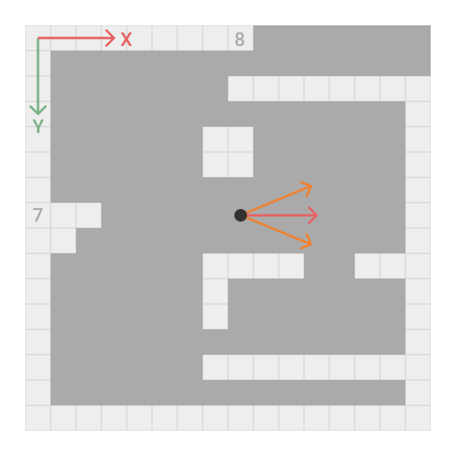

# First Person Shooter

<a id="index"></a>

This project is an exercise from this [Youtube tutorial][VideoTutorial] by [javidx9][YTChannel]. The following text is made up of notes from that tutorial and some personal notes.

## About this project

We can't use our traditional see out method for doing this project, because outputting to the console isn't very quick.
We're going to have to grab the **console buffer** and write to it directly.

The rendering engine for this project is inspired by the [Wolfenstein 3d][RayCastingRendering] game.



For better visualization set default and current properties of **console window**:
- Fonts: consolas 16
- Layout: 120 x 40

## About C++

These are new knowledge for me in this project about C++ language.

```c++
// Wide char
wchar_t someWChar = new wchar_t[ /* length */ ];

// For unicode
wstring someString = L"string";

// Write data with format like printf() in C
swprintf_s( L"String" );
```

```c++
// Pairs
pair< /* type1, type2 */ > somePair;

// Create a pair object, deducing the types of arguments
make_pair< /* value1, value2 */ >
```

```c++
// Lambda functions
sort( p.begin(), p.end(), []( const pair< float, float > &left, const pair< float, float > &right ){ return left.first < right.first; } );
```

```c++
#include <math.h>

sinf( /* angle */ );
cosf( /* angle */ );
acos( /* value */ );
```

```c++
#include <chrono>

// Returns a time_point
auto tp1 = chrono::system_clock::now();

// Time interval
chrono::duration< float > elapsedTime = tp2 - tp1;
float fElapsedTime = elapsedTime.count();
```

```c++
#include <Windows.h>

// Abstract reference value to a resource, like a pointer
HANDLE someHandle;

// Whole number from 0 to 4,294'967,295
DWORD someNumber = 0;

// Create a new screen buffer
HANDLE hConsole = CreateConsoleScreenBuffer( GENERIC_READ | GENERIC_WRITE, 0, NULL, CONSOLE_TEXTMODE_BUFFER, NULL );

// Set the new screen buffer active
SetConsoleActiveScreenBuffer( hConsole );

// Write characters in console
WriteConsoleOutputCharacterA( hConsole, (LPCSTR)screen, nScreenWidth * nScreenHeight, { 0, 0 }, &dwBytesWritten );
WriteConsoleOutputCharacterW( hConsole, (LPCWSTR)screen, nScreenWidth * nScreenHeight, { 0, 0 }, &dwBytesWritten );

// Determines if a key is up or down
GetAsyncKeyState( 'A' );
```

[Arriba][Index]

<!-- TODO: Collision generates tangent movement -->
<!-- TODO: Don´t move out of the map -->
<!-- TODO: Right and left movement -->

<!-- <https://www.asciitable.com/> -->
<!-- <https://theasciicode.com.ar/> -->
<!-- <https://unicodemap.org/range/53/Block_Elements/> -->

[VideoTutorial]:        https://www.youtube.com/watch?v=xW8skO7MFYw
[YTChannel]:            https://www.youtube.com/channel/UC-yuWVUplUJZvieEligKBkA
[RayCastingRendering]:  https://en.wikipedia.org/wiki/Wolfenstein_3D#Development
[Index]:                #index
